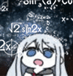

 

<h2>About me</h2>

  I am a full stack developer 
  I’m currently building cool stuff with React, Next.js, and Node.js.  
  Exploring AI, automation, and clean system design.  
  Always learning. Always shipping.  
  Until then… .

 

  
  
  

<h2>
  Some Tools I Use 
  
</h2>

  

  
  
  

<!--
**NubPlayz/NubPlayz** is a ✨ _special_ ✨ repository because its `README.md` (this file) appears on your GitHub profile.

Here are some ideas to get you started:

- 🔭 I’m currently working on ...
- 🌱 I’m currently learning ...
- 👯 I’m looking to collaborate on ...
- 🤔 I’m looking for help with ...
- 💬 Ask me about ...
- 📫 How to reach me: ...
- 😄 Pronouns: ...
- ⚡ Fun fact: ...
-->
